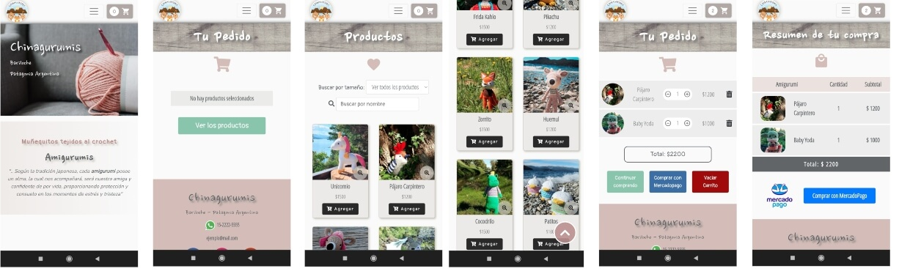

# Chinagurumis
E-commerce de muñecos tejidos al crochet.

## Demo
### [Chinagurumis](https://victorianastasi.github.io/amigurumis/)
 

### Desktop

### Mobile

## Desarrollo
- Para su desarrollo se ha utilizado HTML5, CSS3, SASS, Bootstrap (v 4.4.1), JavaScript, Nodemailer (formulario de contacto), y se ha realizado integración de Checkout Pro de MercadoPago.
- Web responsive, mediante el uso de mediaqueries, desarrollada con la estrategia mobile first.
- Se ha utilizado Git para el control de versiones.
- Para las animaciones, se ha utilizado la librería Animate On Scroll Library.
- Se han utilizado tipografías de Google Fonts.

## Autora
GitHub: [victorianastasi](https://github.com/victorianastasi)

LinkedIn: [Victoria Nastasi](https://www.linkedin.com/in/victoria-nastasi-a3452910b/)